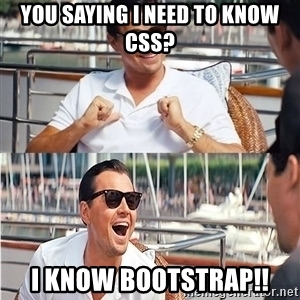
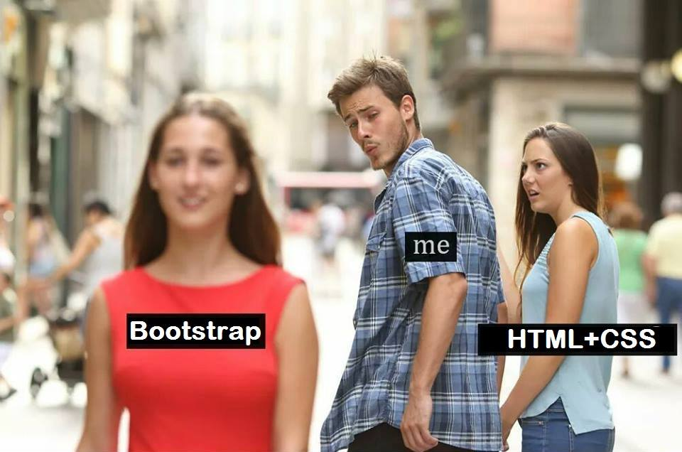
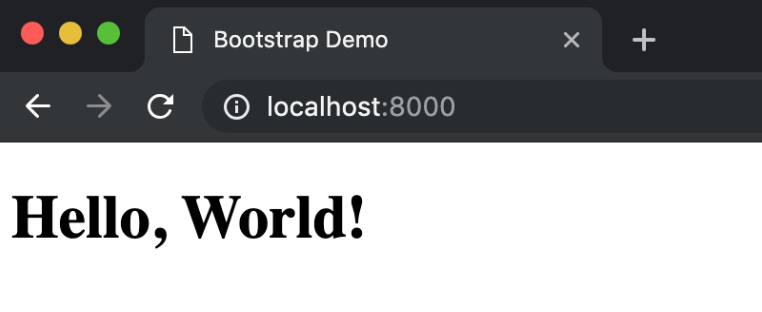

# CS52 Workshops:  Introduction to Bootstrap

Bootstrap is the most popular front-end framework on the web, and we're going to find out why! Let's learn how easy it is to make a mobile-responsive website with very little custom CSS.



 

## Overview

We're going to show you how to quickly put together a website with basic components using the component library Bootstrap. After completing this tutorial, you should have a working, locally hosted website with…
* A Nav Bar
* Jumbotrons
* Buttons
* Column based text
* A carousel of images
* Responsive design
* Minor customization

__Tutorial time: ~20 minutes__

Here's what we're going to create!


## Part 1: Setup + Creating a Locally Hosted Webpage

Create a new folder. Locate that folder, and create empty HTML and CSS files in it using your text editor or the command line:
```
touch index.html styles.css
```
Open these files in a text editor. Just like Short Assignment 1, fill ```index.html``` with some basic HTML content.
```
<!DOCTYPE html>
<html>
   <head>
       <title>Bootstrap Demo</title>
   </head>
   <body>
       <h1>Hello, World!</h1>
   </body>
</html>
```
Next, locally test the mini web page you just created.
For Python 2:
```
python -m SimpleHTTPServer
```

For Python 3:
```
python -m http.server
```

Visit http://localhost:8000 to see your page running. This should be second nature to you after the first few class labs! Your webpage should look something like this: 


## Part 2: Build Using Bootstrap
Great ~ now that you have a basic webpage hosted, let’s get building! :sunglasses:

### A little background on Bootstrap
Bootstrap is a component library, which is an awesome tool because it performs a lot of styling work for you. Instead of having to build components like full-screen background images and image carousels using all kinds of nested divs and spans, Bootstrap does the work for you in pre-set classes! Some useful classes to know about include:
```jumbotron```
```btn```
```.btn-group```
```glyphicon```
```dropdown```
```collapse```
```navbar```
```form-group```
```modal```
(See [here](https://www.w3schools.com/bootstrap/bootstrap_get_started.asp) for more information).

Additionally, (as we discussed) Bootstrap operates on a 12 column grid system. Using Bootstrap, you can use classes to define the space you want a component to take on the screen.
```
class="col-[device size]-[number of columns]"
```
where ```device size``` is ```xs, sm, md,``` or ```lg``` depending on the device, and ```number of columns``` is a number. A caveat here is that the number of columns for every horizontal row should always add up to 12 maximum or else elements will stack.

You can define that space to be different on multiple devices using a class definition like this:
```class="col-sm-[number of columns] col-lg-[number of columns]"```
This is awesome because it makes responsive design way easier!

### Add Bootstrap to Your Website
Let’s add bootstrap to your website using a Content Delivery Network (CDN). Link it in the header like this:
```html
<head>
    <title>Bootstrap Demo</title>
    <link rel="stylesheet" href="https://stackpath.bootstrapcdn.com/bootstrap/4.3.1/css/bootstrap.min.css" integrity="sha384-ggOyR0iXCbMQv3Xipma34MD+dH/1fQ784/j6cY/iJTQUOhcWr7x9JvoRxT2MZw1T" crossorigin="anonymous">
</head>
```
Note: You can also download Bootstrap and use a local version if you want. Checkout the Bootstrap documentation [here](https://getbootstrap.com/docs/4.3/getting-started/introduction/) for more information.

Finally, let’s also link to our personal stylesheet in the head. Make sure you put this note below the link to the Bootstrap stylesheet. (Any ideas on why this might be better than linking it above Bootstap? See Customization section!)
```html
<link rel="stylesheet" type="text/css" href="style.css"> 
```
### Give your webpage a Navigation (Nav) Bar.
First, create an empty nav with a logo:
```html
<nav class="navbar navbar-expand-md navbar-dark bg-dark">
    <a class="navbar-brand" href="https://github.com/dartmouth-cs52-19S/workshop-ws-04-19-css">Bootstrap Demo</a>
</nav>
```
Let’s break down some of these classes. First, Bootstrap’s collapsing nav bars are always declared using ```navbar``` and ```navbar-expand-[device size]```. Next, we declare that we want to use the dark navbar color scheme using ```navbar-dark``` and dark background color scheme using ```bg-dark```. ```navbar-brand``` pre-defines styling for a logo of your choice.

Next, add some buttons underneath that nav declaration:
```html
<div class="collapse navbar-collapse" id="navbarSupportedContent">
    <ul class="navbar-nav mr-auto">
        <li class="nav-item active">
            <a class="nav-link" href="#landing">Jumbotron</a>
        </li>
        <li class="nav-item active">
            <a class="nav-link" href="#sample-columns">Example Cols</a>
        </li>
        <li class="nav-item active">
            <a class="nav-link" href="#example-carousel">Carousel</a>
        </li>
    </ul>
</div>
```
Whoa, that was a lot! :cold_sweat: Let’s break that down too. First, we define the nav bar content to be collapsing based on viewport width using ```collapse``` and ```navbar-collapse```. Next, we add the links we want to see in the nav bar as list items and define their standard nav bar style using class values like ```navbar-nav```, ```nav-item active``` and ```nav-link```. Note: ```mr-auto``` is used to preset standard margins for the  list items that follow.

Finally, make your content automatically collapse into a hamburger menu:
```html
<button class="navbar-toggler" type="button" data-toggle="collapse" data-target="#navbarSupportedContent" aria-controls="navbarSupportedContent" aria-expanded="false" aria-label="Toggle navigation">
    <span class="navbar-toggler-icon"></span>
</button>
```
This code creates a little hamburger menu to hold nav bar content upon collapse. Otherwise, collapsing the screen just makes the nav bar items look like they have disappeared.

Refresh your local page, and try re-sizing the browser to see the mobile responsiveness in action! The creators of Bootstrap already did the work of implementing navigation items and re-sizing, saving you time (no more checkbox hack needed!).

### Give your webpage a welcome component.
```html
<div id="landing" class="jumbotron">
    <h1>Hello, World!</h1>
    <button class="btn btn-dark">I like to code</button>
</div>
```
This code creates a landing segment with a greeting and button to welcome the user.

Your site should look something like this:


### Create some basic content.
First, let’s define a space to put the content:
```html
<div id="sample-columns" class="container">
    <div class="row">
    </div>
</div>
```
We use the ```container``` and ```row``` classes to define the width components should take up within the viewport. ```container``` is the parent container that the grid lives in. In Bootstrap, ```row``` is the primary container, and consists of a set of columns. Within this new frame, we can plug in our content:
```html
<div class="col-lg-4 col-md-4 col-sm-12 col-xs-12">
    <h3>I'm column 1</h3>
    <p>beep boop bop beep boop bop beep boop bop beep boop bop beep boop bop beep boop bop beep boop bop beep boop bop beep boop bop beep boop bop beep boop bop beep boop bop beep boop bop beep boop bop beep boop bop beep boop bop beep boop bop beep boop bop </p>
</div>
<div class="col-lg-4 col-md-4 col-sm-12 col-xs-12">
    <h3>I'm column 2</h3>
    <p>bing bang boom bing bang boom bing bang boom bing bang boom bing bang boom bing bang boom bing bang boom bing bang boom bing bang boom bing bang boom bing bang boom bing bang boom bing bang boom bing bang boom bing bang boom bing bang boom bing bang</p>
</div>
<div class="col-lg-4 col-md-4 col-sm-12 col-xs-12">
    <h3>I'm column 3</h3>
    <p>splish splash sploosh splish splash sploosh splish splash sploosh splish splash sploosh splish splash sploosh splish splash sploosh splish splash sploosh splish splash sploosh splish splash sploosh splish splash sploosh splish splash sploosh splish splash sploosh </p>
</div>
```
Basically, what this code does is define three structures to hold some text information, which each take up different numbers of columns in the Bootstrap grid based on device size. On large devices, they will take up 4 columns (⅓ of the screen) each and sit side by side. On smaller devices, they will take up 12 columns each and they will simply fill the screen. This makes developing websites with responsive design really fast! :zap:

Here's what you should have at this point:


_Another note on how Bootstrap approaches columns:_

For one, you don't have to specify width! ```<div class="col">``` tells Bootstrap to automatically size every ```div``` in this row as equal width.

Second, Bootstrap operates based on minimum device sizes, so that you don't have to specify grid dimensions for every size of device. So, ```<div class="col-sm-12 col-md-4">``` sets the container to be full-width on smaller devices, and only 4/12 units wide on any device sized medium or larger.

### Give your webpage a carousel. 
Sweet, things are looking good! :nail_care: You’ll notice a lot of automatic styling has been implemented. (We haven’t even opened our own stylesheet!) On to the cool stuff…

To create a carousel, lets first define a nice space for it to be displayed:
```html
<div id="example-carousel" class="jumbotron">
    <div class="container">
    </div>
</div>
```
We chose to implement this inside a ```jumbotron``` because we liked the automatic spacing and background color it created. The ```container``` class is important for defining the width on the screen for the carousel to take up.

Within this frame, plug in this code:
```html
<div id="carouselExampleCaptions" class="carousel slide" data-ride="carousel">
    <ol class="carousel-indicators">
        <li data-target="#carouselExampleCaptions" data-slide-to="0" class="active"></li>
        <li data-target="#carouselExampleCaptions" data-slide-to="1"></li>
        <li data-target="#carouselExampleCaptions" data-slide-to="2"></li>
    </ol>
    <div class="carousel-inner">
        <div class="carousel-item active">
            
            <div class="carousel-caption d-none d-md-block">
                <h5>First slide label</h5>
                <p>Nulla vitae elit libero, a pharetra augue mollis interdum.</p>
            </div>
        </div>
        <div class="carousel-item">
            
            <div class="carousel-caption d-none d-md-block">
                <h5>Second slide label</h5>
                <p>Lorem ipsum dolor sit amet, consectetur adipiscing elit.</p>
            </div>
        </div>
        <div class="carousel-item">
            
            <div class="carousel-caption d-none d-md-block">
                <h5>Third slide label</h5>
                <p>Praesent commodo cursus magna, vel scelerisque nisl consectetur.</p>
            </div>
        </div>
    </div>
    <a class="carousel-control-prev" href="#carouselExampleCaptions" role="button" data-slide="prev">
        <span class="carousel-control-prev-icon" aria-hidden="true"></span>
        <span class="sr-only">Previous</span>
    </a>
    <a class="carousel-control-next" href="#carouselExampleCaptions" role="button" data-slide="next">
        <span class="carousel-control-next-icon" aria-hidden="true"></span>
        <span class="sr-only">Next</span>
    </a>
</div>
```

What the heck?!?!? That’s so much code, what does it mean?? It’s not as complicated as it looks. To create a carousel, we basically just create a bunch of slides and buttons. First, in the ordered list (```<ol>```) with the class value ```carousel-indicators```, we define our clickable slide indicators visible underneath the caption on every slide. Next, we create divs to hold our images and text, which function as our slides. We use the indicators and the class value ```active``` to control which side is displayed. Finally, we create some controls (the little arrows) to make carousel navigation simpler.

If you want more information specifically on how this code snippet works check out this link:
<https://getbootstrap.com/docs/4.0/components/carousel/>
We took the code almost directly from the Bootstrap documentation.

Now, your site should be looking very similar to the example at the top!

### Customization
Let’s actually put our stylesheet to work! Using Bootstrap tends to lead to websites that look similar to each other, but you can spice it up by defining some of your own styles. We’re going to put an image behind our first jumbotron as an example. (Note: It is better to link your stylesheet below the Bootstrap stylesheet because it allows you to override Bootstrap’s styles without having to declare levels of importance using ```!important```.)

Open up style.css and plug in the following code:
```css
#landing.jumbotron {
   background-image: url("https://picsum.photos/1300/200/?image=29");
   background-size: cover;
}
#landing.jumbotron h1 {
   color: #FFF;
   text-shadow: 2px 1px #000;
}
```
The first section of this code adds a background image to the div with the id “landing” and class “jumbotron.” The second section changes the color of the text in that same div to be more visible on the image. It’s a simple example, but it shows how any bit of the Bootstrap library is customizable because it is fundamentally based on CSS (and occasional JavaScript).

Fun Fact: Bootstrap 4 is based on Flexbox, but Bootstrap 3 (and earlier versions) is based on floats!

### Bonus: Add images (if you have time!)

Here's a little challenge! 

If you have time, try to flex your Bootstrap layout skills by adding a row of images below the text columns you created. You should do this by creating a new ```container``` with a ```row``` within it, following the best practices demonstrated above. Aim for this row to be 4 images wide; if you do it right, it should dynamically re-size when you change the window size. Reach out to the workshop leaders if you need help!

## Extras

Tired of hosting things in gh-pages? Surge is a really easy way to quickly deploy projects. If you’re interested in deploying this site, first install surge using a package manager of your choice (brew, npm, yarn, etc.):
```npm install --global surge```
Next, navigate to the directory your project is in and run:
```surge```
You’ll be asked to verify the directory you want to deploy and to confirm a name for your project. Work through the prompts, and you will be provided a URL that is almost immediately active with a deployed version of your project. You can also change that auto-generated URL to any custom one as long as it's at the domain ```.surge.sh```. More information on surge deployment can be found at <https://surge.sh/>.

## Final Product

Congrats! If everything went to plan, you should have a functioning website running on your local host that dynamically scales when you resize the window! Check out our example, deployed with Surge, [here](http://cs52-bootstrap-workshop.surge.sh/).

At this point you should have:
* A nav bar that resizes to a hamburger menu in mobile
* A primary CTA button
* Column-based text that re-arranges in mobile
* A carousel of images
* Minor customizations in CSS

## Summary

Bootstrap is a dynamic, easy-to-use, and **free** front-end framework that adds quicker functionality and syntax to basic HTML and CSS. You can use it's class-based identification system to place items in flexbox-style grids. It also has a series of custom-made HTML components like buttons, cards, and jumbotrons, to simplify the process of styling your site. Still, Bootstrap has some limitations in customizability and can result in very standard-looking websites. 

All around, it's perfect for creating quick websites without worrying about the semantics of flexboxes and default HTML stylings.

## Learning Objectives

After completing this tutorial and getting a working site together, you should have a much better idea of the fundamentals of Bootstrap. At this point, you should:

* [ ] Understand how to import Bootstrap directly through CDN
* [ ] Grasp Bootstrap's dynamic container and 12-column grid model
* [ ] Know how to use Bootstrap components, such as buttons, in your HTML
* [ ] Understand how to override Bootstrap CSS to implement custom styles
* [ ] Recognize the limitations of Bootstrap
* [ ] Be able to use Bootstrap to quickly create dynamic sites whenever you need!

## Reflection

Time to get reflective. 

* [ ] When do you think you might be able to use Bootstrap in the future? When would you not want to?
* [ ] What are some issues/downsides you could run into by using Bootstrap in industry?

## Sources
* Background on Bootstrap from:
  * <https://www.w3schools.com/bootstrap/bootstrap_grid_system.asp>
* Bootstrap Documentation used heavily for code snippets:
  * <https://getbootstrap.com/docs/4.0/components/>
* freeCodeCamp tutorial used for guidance and code snippets in developing this tutorial:
  * <https://medium.freecodecamp.org/learn-bootstrap-4-in-30-minute-by-building-a-landing-page-website-guide-for-beginners-f64e03833f33>
* Tania Rascia tutorial used for guidance and code snippets in developing this tutorial:
  * <https://www.taniarascia.com/what-is-bootstrap-and-how-do-i-use-it/>

